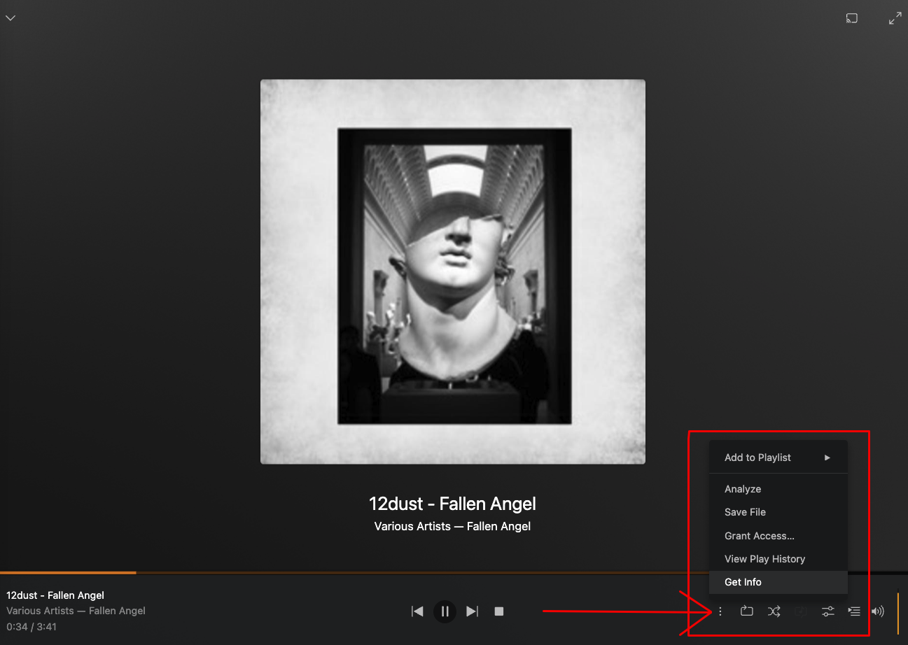
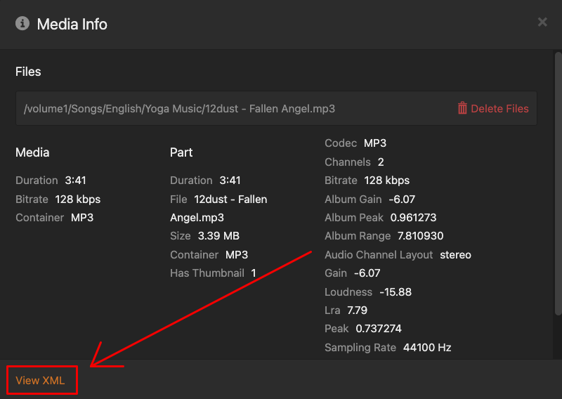

# STEP 1: Login to Plex in Browser

# STEP 2: Play any audio / music from the local server 

# STEP 3: Click the 3 dots and Click GetInfo 

# STEP 4: Click on View XML 

# STEP 5: Copy the X-Plex-Token from the URL address bar at the end 

