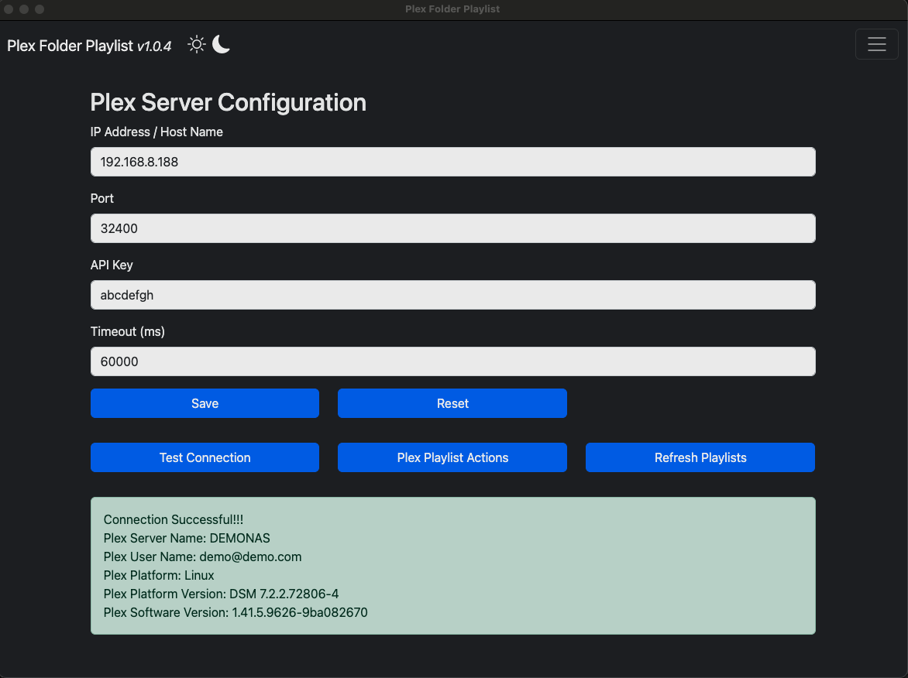
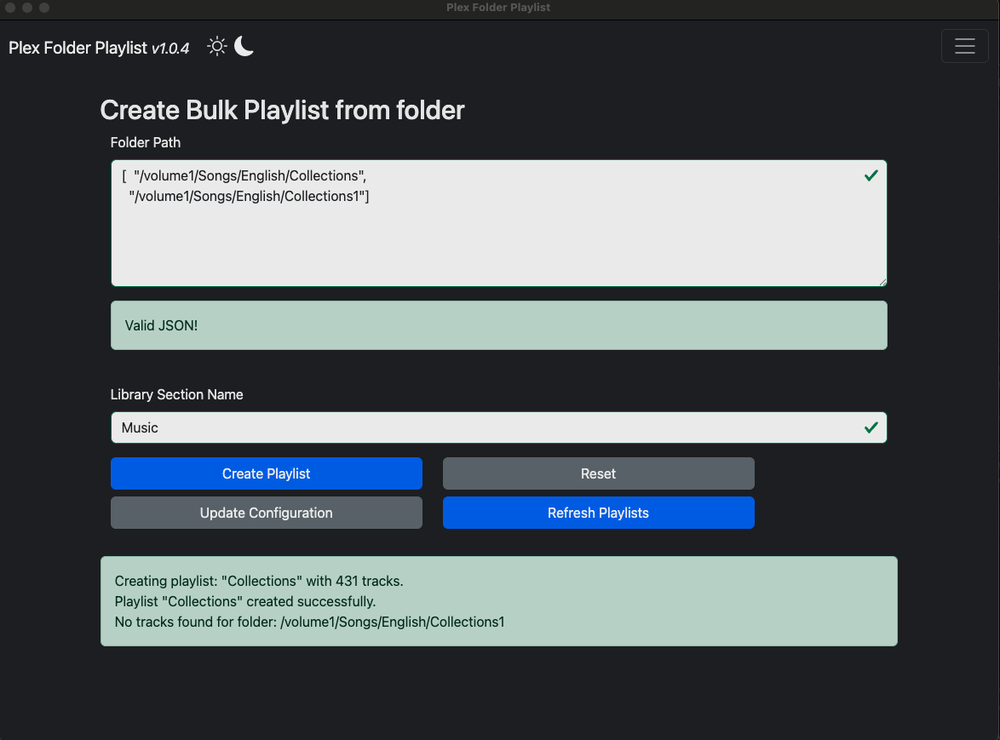
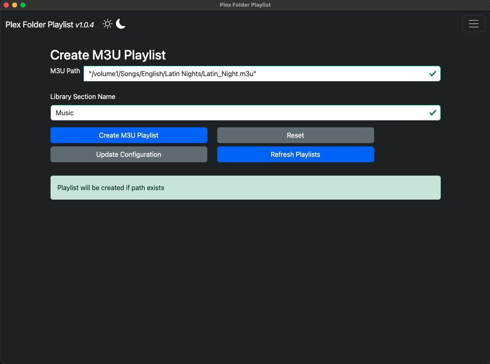

# Plex Folder Playlist Creator

Plex Folder Playlist Creator is a modern desktop application built with Electron JS that generates playlists for media files in a selected folder. This cross-platform app simplifies playlist creation by scanning your folder, extracting metadata, and structuring playlists for easy playback. It integrates seamlessly with the Plex API for advanced media management features and provides a sleek user interface using Bootstrap and Bootstrap Icons.

## App Supports Windows / Linux / MacOS Checkout the [Releases](https://github.com/zackria/Plex-Folder-Playlist-Creator/releases)


## Features
- Folder Scanning: Easily scan folders to detect media files.
- Playlist Generation: Automatically create playlists in supported formats.
- Persistent Settings: Save and load user preferences using electron-settings.
- Plex Integration: Connect to Plex Media Server for enhanced media metadata and playlist synchronization.
- Cross-Platform: Runs seamlessly on Windows, Mac, and Linux.
- Modern UI: Built with Bootstrap for a responsive and user-friendly interface, enhanced with Bootstrap Icons for intuitive navigation.

## How It Works
- Install the App: Download and install the app from the release folder.
- Launch the App: Open the Plex Playlist Creator App.
- Connect: Connect to your Plex server using `HOST IP`, `PORT`, `PLEX TOKEN`.
- Save Settings: User preferences (e.g., Host IP, Port, Plex token, theme) are saved for future use.
- Test the Connection: Test the connection and read metadata.
- Get Playlists: Retrieve the playlists.
- Create Playlist: A playlist file is generated automatically based on the media in the specific folder.
- Bulk Playlist Creation: Multiple playlist files are generated automatically based on the media in the specific folders.
- Plex Integration: Optionally connect to a Plex Media Server to fetch metadata and sync playlists.

### Build using 
- #### Node JS v22.13.0 (lts/jod)
- #### NPM 11.0.0

#### How to find Host IP, PORT, and PLEX TOKEN 
- How to find HOST IP & PORT NUMBER [Refer to this Link](FINDHOST_PORT.md)
- How to find the PLEX TOKEN [Refer to this Link](FINDPLEXTOKEN.md)









## Platform Compatibility
- Electron Playlist Creator is designed to work on the following platforms:
    - Windows: Easily installable as a .exe file.
    - Mac: Available as a .dmg package.
    - Linux: Distributed as .deb or .AppImage formats for wide compatibility.

## Buy me a coffee
[Buy me a coffee](https://buymeacoffee.com/zackdawood)

## Libraries Used
This app leverages the following key libraries to deliver its functionality:

1. [electron-settings](https://github.com/nathanbuchar/electron-settings) `^4.0.4`
     A simple, persistent, and type-safe settings manager for Electron applications.
     Used for saving and retrieving user preferences like default folder paths and playlist configurations.

2. [plex-api](https://github.com/phillipj/node-plex-api) `^5.3.2`
     A lightweight and simple Node.js wrapper for interacting with the Plex Media Server API.
     Used for fetching metadata and integrating playlists with Plex.

3. [Bootstrap](https://getbootstrap.com/)
     A powerful front-end framework for building responsive, mobile-first web interfaces.
     Used to create a modern, sleek, and responsive desktop app design.

4. [Bootstrap Icons](https://icons.getbootstrap.com/)
     A collection of free, high-quality icons designed to integrate seamlessly with Bootstrap.
     Used to enhance user experience with visually appealing and intuitive icons.

## Want to add a feature? Follow the steps below to clone, install, and update

- Contribute! I'll be happy to accept pull requests!
- Bug hunting! [Report](https://github.com/zackria/Plex-Folder-Playlist-Creator/issues) them!
- Feature request? Please let me know by filling an [issue](https://github.com/zackria/Plex-Folder-Playlist-Creator/issues)!
- Star this project on [GitHub](https://github.com/zackria/Plex-Folder-Playlist-Creator).


## Known Issues Unsigned in MacOS
### Users will get a message as "PlexFolderPlaylistCreateor.app" is damaged and can't be opend.You should it to the Trash.


### Why it happens ?
This is a security feature from macOS. Because the app isn't signed and is from an unidentified developer, you're seeing this warning.

When an application gets downloaded from any source other than those that Apple seems suited, the application gets an extended attribute "com.apple.Quarantine". This triggers the message: " is damaged and can't be opened. You should move it to the Bin."

Remove the attribute and you can launch the application.

To do this, open a console and type:

`xattr -c <path/to/application.app>`


### Fix 


## Installation

1. Clone the repository:
     `git clone https://github.com/zackria/Plex-Folder-Playlist-Creator.git`

2. Navigate to the project directory:
     `cd Plex-Folder-Playlist-Creator`

3. Install dependencies:
     `npm install`

     #### Note: If npm install do not work in Windows 
     `Set-ExecutionPolicy RemoteSigned`

     `Set-ExecutionPolicy RemoteSigned -Scope CurrentUser`

4. Start the app:
     `npm start`


```NOTE: Rebuild instructions```

`npm run clean`


## Electron Build Instructions

`npm run package`

`npm run package-mac`

`npm run package-linux-deb`

`npm run package-linux-rpm`

`npm run package-win`

`npm run make`


## Roadmap
- Add support for custom playlist formats.
- Advanced media file filtering and categorization.
- Real-time metadata updates with Plex.
- Additional themes and customization options for the UI.

