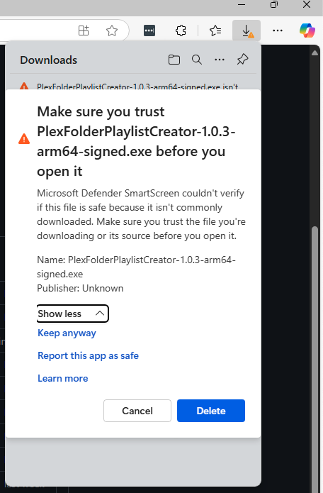

### Table of Contents
- [Bypass Antivirus and Install the Application](#steps-to-bypass-antivirus-and-install-the-application)
- [Install the Certificate](#steps-to-install-the-certificate)

---

### Known Issues Unsigned in Windows (Publisher Unknown)
### Users will get a message as "PlexFolderPlaylistCreator.exe" isn't commonly downloaded. Make sure you trust "PlexFolderPlaylistCreator.exe" before you open it.

#### Antivirus couldn't verify if this file is safe because it isn't commonly downloaded. Make sure you trust the file you're downloading or its source before you open it. Publisher Unknown

#### Microsoft Defender SmartScreen prevented an unrecognized app from starting. Running this app might put your PC at risk.

### Steps to Bypass Antivirus and Install the Application

1. When you see the warning message, click **See more or More Info**. 

2. Select **3 Dots and Click Keep** to proceed with the Download.

3. If prompted by another warning, click **Show More** to continue download.

4. Click **Keep anyway** to finish download.

5. If additional warnings appear, click **See more or More Info**. 

6. Click **Run anyway** 

---

### Steps to Install the Certificate

1. Locate the certificate file provided with the application.
2. Right-click on the application and click **Properties**.

3. Choose **Digital Signatures** tab and click **View Certificate**.

4. Click **Install Certificate**.

